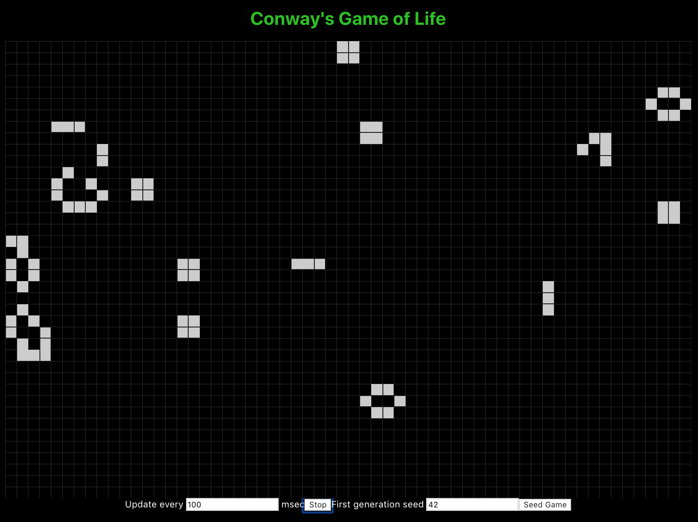

# gol-react
## Conway's game of life built in reactJS

------------
### Rules of life
1. Any live cell with fewer than two live neighbors dies, as if caused by under population.
2. Any live cell with two or three live neighbors lives on to the next generation.
3. Any live cell with more than three live neighbors dies, as if by overpopulation.
4. Any dead cell with exactly three live neighbors becomes a live cell, as if by reproduction.

[See the wiki for more details.](https://en.wikipedia.org/wiki/Conway%27s_Game_of_Life)

-----------
### Development Commands 

`yarn`
  Install all dependencies for a project

`yarn start`
  Starts the development server.

`yarn build`
  Bundles the app into static files for production.

`yarn test`
  Starts the test runner.
